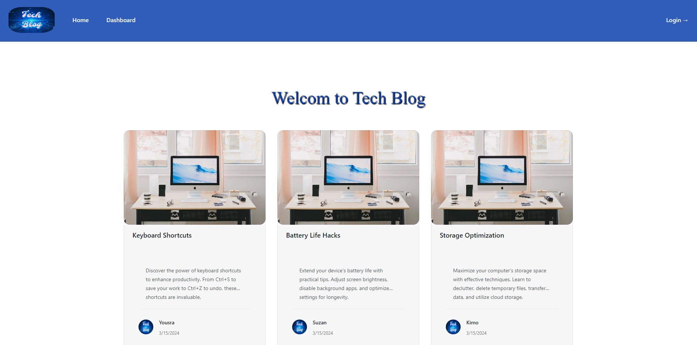
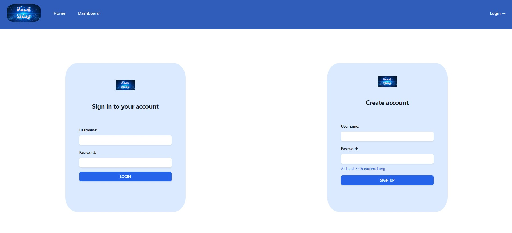
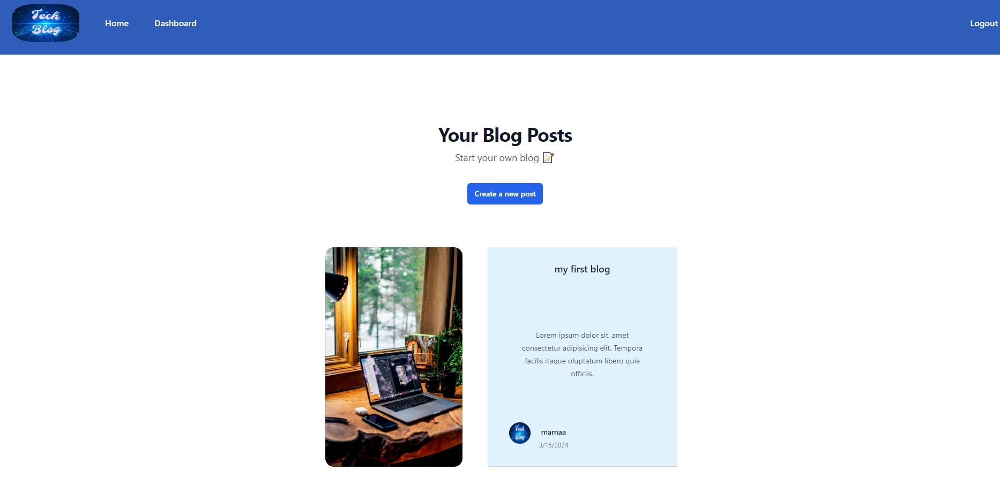

# Tech Blog

## Description

Tech Blog provides a content management system (CMS) to run a blog site. Users can log in to publish a post on the site and leave comments on posts. Logged in users have the ability to edit or delete previous posts from their dashboard. Non-logged in users can freely view published posts, but need to sign up to publish posts or leave comments.

Tech Blog is a full stack web application built following the Model View Controller (MVC) design paradigm. It uses MySQL and Sequelize for model definition and interaction, handlebars.js as the HTML view templating engine, and express.js for the server. The site uses cookies and session data to restrict access to publishing posts and comments to logged in users.

The web application is hosted on Heroku. Link to deployed website: [Tech BLog](https://whispering-forest-22574-8ad33503dc46.herokuapp.com/)

## Installation

If you would like to install this project on your local computer:
- Download or clone repository to use this application on local machine.
- Node.js is required to run the application
- To install necessary dependencies, run the following command :
  `npm i`

Note:

- If you would like to build your own website, make sure you have a database you can run the seeds into. Seeds are sample rows for each model (table), to give you some starter data. Reading the package.json and make sure you read the script and seeds code, as well as run an npm install.

- This project is hosted on Heroku and utilizes JawsDB. The .env is not uploaded to GitHub for security reasons, but to fully replicate this website on a cloud-based platform, you will need to generate a connection string in order to seed the data through a database on such a platform as Heroku.

## Application Preview

Homepage

Login/Signup Page

Dashboard

## Credits

- USYD-Bootcamp (week 14 class activities)
